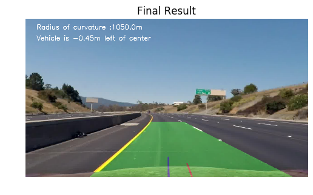

# Advanced Lane Lines Finding

In this project, we use computer vision techniques to detect road lane lines, estimate the road curvature, and the car offset with the center of the lane.

## Summary
The steps of the Line finding pipeline are:
* Camera calibration (camera calibration matrix and distorsion coefficients)
* Apply a distortion correction to the raw image.
* Use image processing (color transforms, gradients, etc...) to create a thresholded binary image.
* Apply a Perspective Transform to rectify binary image ("birds-eye view"-like).
* Detect lane pixels and fit to find the lane boundary.
* Determine the curvature of the lane and the vehicle position with respect to the lane center.
* Warp the detected lane boundaries back onto the original image.
* Output visual display of the lane boundaries and numerical estimation of lane curvature and vehicle position.

## How to run?
Run the IPython notebook **advLaneLine_P4.ipynb**

To run the code on an arbitrary video file, update the 6th code cell with the name of the input video file:

```python
video_output = 'project_solution.mp4' # name of the video file generated by the lane detector
clip1 = VideoFileClip("project_video.mp4") #original video file
white_clip = clip1.fl_image(pipeline)
%time white_clip.write_videofile(video_output, audio=False)
```


## Camera calibration
The Camera calibration is done with the function `camera_calibration()` in the 2nd code cell of the Ipython notebook.

```python
def camera_calibration(folder, nx, ny, showMe=0):
    '''
    find (x, y) locations of all corners using openCV findChessBoardCorners
    folder: directory of the calibration images
    nx: expected number of corners along the x direction
    ny: expected number of corners along the y direction
    return a dictionary:
        ret: RMS Error of the calibration
        mtx: the camera matrix
        dist: distorsion coefficients
        rvecs: rotation vectors
        tvecs: translation vectors
    '''
    .......
```
The camera calibration is done with images of chessboard taken from different viewpoints. The images are first converted to grayscale and then processed by the OpenCV function `cv2.findChessboardCorners()` to locate all the corners in the image: (*nx* x *ny*), where *nx*=9 and *ny*=6. If the image has less corners, it is disregarded.

<table><tr><td>
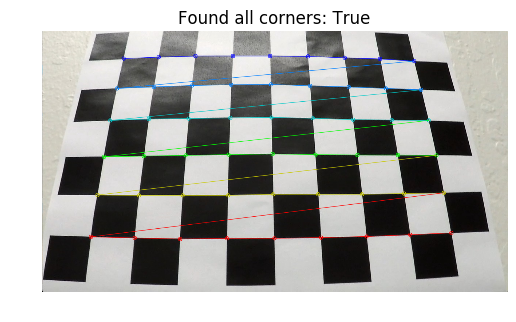
</td></tr><table>
**Figure 1.** Example of a calibration image where all the corners (colored dots) were found by `cv2.findChessboardCorners()`.
<br>
<br>

The coordinates (*x*, *y*) of the corners in the image are stored in the array `imgpoints`, and the corresponding (*x*, *y*, *z=0*) coordinates in the real world (3D space) are stored in the array `objpoints`. After all the images are processed, the arrays are passed to the function `cv2.calibrateCamera()`. That function returns the **camera matrix**, the **distorsion coefficients** and the RMS Error (`ret`) of the calibration. I get a RMS Error `ret`=1.030: it means that a pixel reprojected onto the original image is in average 1px off its true position. The output of the function `camera_calibration()` are stored in a dictionary called `calib_params`.

The function `correction()` (2nd code cell) enables to apply distorsion corrections to raw images. It uses the openCV function `undistort()` with the distorsion coefficients and the camera Matrix.


```python
def correction(image, calib_params, showMe=0):
   	 '''
   	 Distorsion correction
   	 calib_params: calibration parameters returned by camera_calibration()
   	 '''
```


<br>
<br>
<table><tr><td>
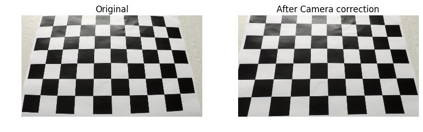
</td></tr><table>
**Figure 2.** An example of an image before and after the camera correction. Note that the last row of corners at the bottom of the corrected image are now practically aligned with the horizontal axis.
<br>
<br>

## Lane Detection Pipeline

All the functions used for the image processing are in the 3rd code cell of the IPython notebook: they are methods of the class `ImageProcess()`.
<br>
<br>
<table><tr><td>

</td></tr><table>
**Figure 3.** The diagram describes the image processing in the line detection pipeline.
<br>
<br>

### 1. Distorsion correction

The original image is undistorted using the function `image_correction()`. It takes as arguments: the image, the camera matrix and the distorsion coefficients, and returns the undistorted image.

```python
def image_correction(self, img, cal_params):
    '''
    correct image from camera distorsion
    img: original image RGB format
    cal_params: calibration parameters of camera (Camera Matrix and distorsion Coefficients)
    return: undistorted image
    '''
```

<br>
<table><tr><td>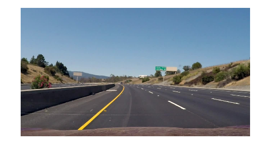</td><td>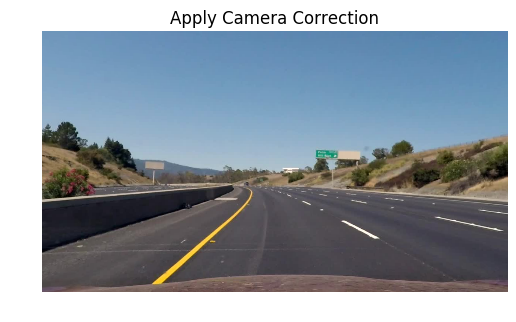</td></tr></table>

**Figure 4.** The raw image (left), and the image after applying the distorsion correction (right).
<br>


### Threshold Binary

The color image image is then converted to Grayscalre and passed to the function `ImageProcess.directional_gradient()`. The function enables to extract edges using the Sobel operator along the horizontal direction. A threshold is applied with the bandwidth [25, 255] to generate a binary image.


```python
def directional_gradient(self, img, direction='x', thresh=[0, 255]):
        '''
        Gradient along vertical or horizontal direction using OpenCV Sobel 
        img: Grayscale image
        direction: x(horizontal) or y(vertical) for gradient direction
        thresh: apply threshold on pixel intensity of gradient image
        output is a binary image
        '''
```

<table><tr><td>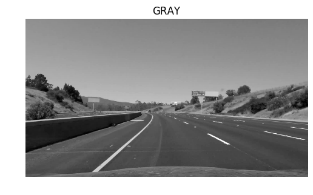</td><td>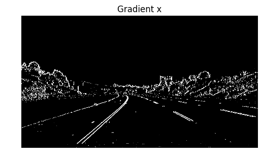</td></tr><table>

**Figure 5.** Grayscale image and the edge detector using Sobel x operator.


I also use **Color transform**: converting the RGB image to HLS format. A thresholding with the range [50, 255] was applied on the channel S only, the other channels were disregarded. 

```python
    def color_binary(self, img, dst_format='HLS', ch=2, ch_thresh=[0,255]):
        '''
        Color thesholding on channel ch
        img: RGB
        dst_format: destination format (HLS or HSV)
        ch_thresh: pixel intensity threshold on channel ch
        output is a binary image
        '''
```


<table><tr><td></td><td>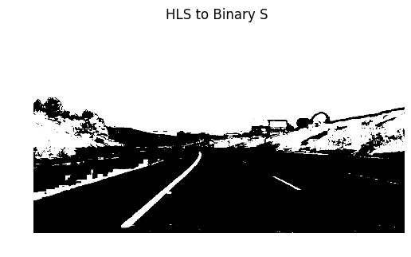</td></tr></table>
**Figure 6.** On the left, it is the original image and the right image shows the binary image aftre thresholding the S channel of the HLS image.

The gradient image and the thresholded S channel image are then combined (in the function `pipeline()` in the 5th code cell) to create a binary image (see Figure 7.a).


```python
    gradx = process.directional_gradient(gray, direction='x', thresh=gradx_thresh )
    ch3_hls_binary = process.color_binary(image, dst_format='HLS', ch=3, ch_thresh=ch_thresh)
    combined_output = np.zeros_like(gradx)
    combined_output[((gradx == 1) | (ch3_hls_binary == 1) )] = 1
```

On the combined binary image, a ROI mask is applied to remove signals that may come from outside the lane and that could affect the robustness of the lane detector: for example a car on a adjacent lane.
Finally, I use a filter to remove noise like the salt and pepper noise, and small aggregates of white pixels. The function `remove_small_objects()` is part of the module `morphology` (from **skimage** package). I chose to remove connected elements that are smaller than 50px.

Here is the code block related to the last 2 processing (it is in the function `pipeline()` - 5th code cell of the notebook) :

```python
    #apply ROI mask
    mask = np.zeros_like(combined_output)
    vertices = np.array([[(100, 720), (545, 470), (755, 470), (1290, 720)]], dtype=np.int32)
    cv2.fillPoly(mask, vertices, 1)
    masked_image = cv2.bitwise_and(combined_output, mask)
    #Removing small aggregates of hotpixels
    cleaned = morphology.remove_small_objects(masked_image.astype('bool'), min_size=min_sz, connectivity=2)
```

<br>
<table><th><td>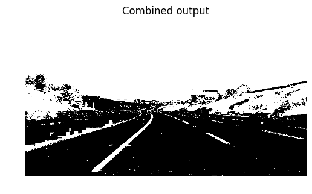</td>
<td>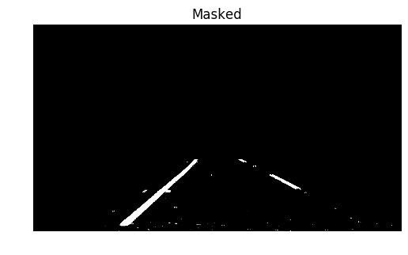</td>
<td>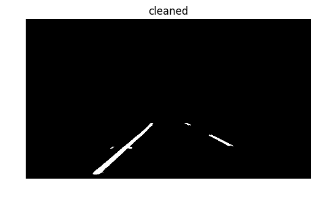</td></th></table>
**Figure. 7 (a)** Binary image after Threshold Binary. **(b)** After applying the ROI, and then **(c)** after using the function `remove_small_objects()`.

The right image is the final binary image that will be used for the Perspective Transform

### 3. Perspective Transform

The perspective transform consists of transforming the binary image to a 'birdeye view'-like image where straight lines remain straight after the transformation. The perspective transform is performed with the function `ImageProcess.birdView()` (3rd code cell).

```python
    def birdView(self, img, M):
        '''
        Transform image to birdeye view
        img: binary image
        M: transformation matrix
        return a warped image
        '''
        img_sz = (img.shape[1], img.shape[0])
        img_warped = cv2.warpPerspective(img, M, img_sz, flags=cv2.INTER_LINEAR)
        
        return img_warped
```

The openCV function `cv2.warpPerspective()` and the transformation matrix *M* are used for the transformation.
The transformation matrix *M* and its inverse are computed by the function `perspective_transform(src_pts, dst_pts)` (in the 5th code cell of the IPython notebook) using the OpenCV function `cv2.getPerspectiveTransform` and a set of source points and of destination points. 

```python
	def perspective_transform(src_pts, dst_pts):
    	'''
    	perspective transform
    	args: source and destination points
    	return M and Minv
    	'''
    M = cv2.getPerspectiveTransform(src_pts, dst_pts)
    Minv = cv2.getPerspectiveTransform(src_pts, dst_pts)
    
    return {'M': M, 'Minv':Minv}
```

The source points were manually picked on the original image (see Figure 8):

|Source	   | Destination |
|----------|-------------|
|240, 720  | 240, 7200   |
|575, 470  | 240, 0      |
|735, 470  | 1200, 0     |
|1200, 720 | 1200, 720   |


In order to select the source points we chose an image where the car is in a straight portion of the road. After the transformation of the image, we make sure that the lines are straight and parallels. 

<table><tr><td>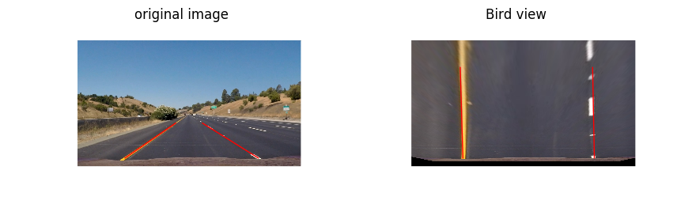</td><td>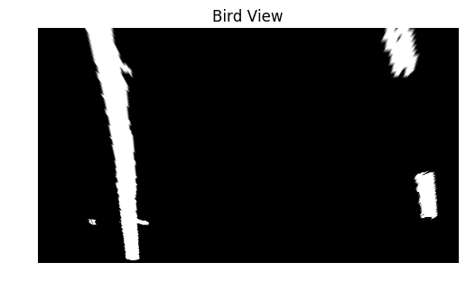
</td></tr></table>
**Figure 8.** (a) Original image : 2 points from each red line were used as source points. (b) the image after transform perspective. (c) a warped image after the perspectivet transform was applied.


After applying the transform the image is not binary anymore, the pixel intensities is in the range [0, 1]

#### 4. Lane lines pixels identification

The identification of the pixels of the lane lines is done in 4 steps using the methods of the class `Line()` (4th code cell of the notebook).

* step 1: calculate the histogram of the bottom half of the image to determine the approximate position of the left and right lines. The following methods are used: `Line.find_starter_centroids()` and `Line.find_centroid()`.


<table><tr><td>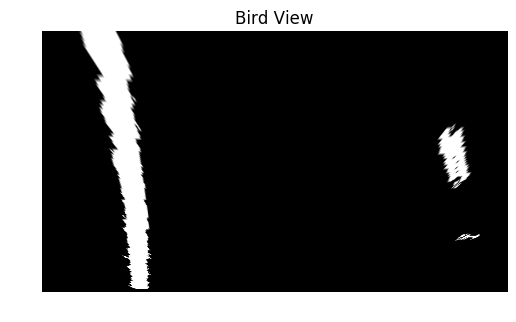</td><td>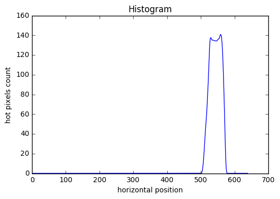</td></tr></table>
**Figure 9.** (a) The warped image and (b) the histogram of the bottom left half of the image.

The peak position of the histogram (so called the *starter centroid*) gives a rough position of the left line on the x-axis. Similarly, we get the *starter centroid* for the right line.

* step 2: Run a sliding window scheme and record the coordinates of the hotpixels (pixels with intensity $\neq $0). The sliding window specifications are: width=120px and height=68px. Starting from the bottom of the image at the *x* coordinate given by the starter centroid, the sliding window scans the image from bottom to top and record the coordinates of the hotpixels in the window. A histogram of the pixels in the window is also computed at every step: this is used to recenter the window as it moves towards the top.

* step 3: Polynomial fit
We fit the hotpixels to a polynom of the 2nd order.
Instead of fitting the data using the hotpixels from the current frame only, we superimpose the hotpixels of the last 9 frames (`buffer_sz=9`).
<table><tr><td>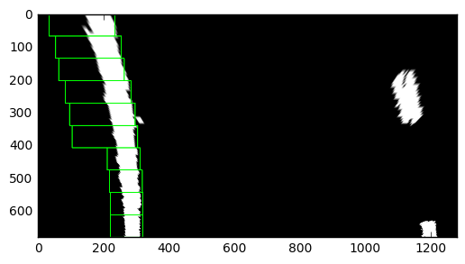</td><td>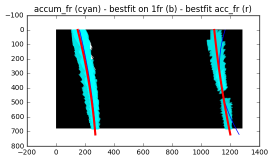</td></tr></table>
**Figure 10.** (a) Warped image with the sliding windows on the left line. (b) Accumulated hotpixels over the last 9 frames(cyan), hotpixels of current frame (white), polynomial fit to current frame(blue) and polynomila fit to accumulated hot pixels (red).

This scheme makes use of the temporel correlation between successive frames, and improves the robustness of the algorithm. Figure 8 shows the difference between the fit to the current frame only (blue line) and the fit when using the past frames. The red fit is more consistent with the expected curvature of the line.

* step 4: smoothing
I implemented 2 smoothing schemes based on the concept of moving average: a weighted and non weighted average. For this project, the non-weighted average was good enough to get good results. The code for the smoothing is performed by the method `Line.mva_smoothing()`. By smoothing out the coefficients of the fit, the algorithm is more robust to noisy input.

```python
def mva_smoothing(self, tracker, weighted=False):
        '''
        Moving average smoothing of polyfit coefficients 
        weighted: True, use weighted average 
                (1a + 1/2b + 1/3c...)/(1+1/2+1/3...) where a is the most recent frame, b 2nd most recent, etc...
                False: use mean
        '''
```

### 5. Radius of Curvature 
The radius of curvature is estimated from the coefficients of the polynomial fit:

$$ R = \frac{(1 + (2 a_2 y + a_1)^2 )^{3/2}}{|2 a_2|}$$

where the polynom has the form $$a_2 y^2 + a_1 y + a_0$$

 The coordinates of the hotpixels are converted from pixels to meters with the following conversion (see Figure 11):

* along y: 1px --> 12/450
* along x: 1px --> 3.7/530

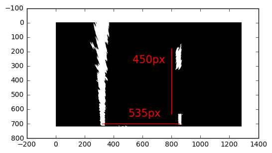

**Figure 11.** Width of the lane and head-to-head distance between 2 successive dash lines.

The method `Line.compute_radOfCurvature()` is used to compute the radius of Curvature:

```python
 def compute_radOfCurvature(self, coeffs, pt):
        '''
        compute radius of curvature in meter or pixels
        polyfit coeffs is of the form {'a2': val2, 'a1': val1, 'a0': val0}
        pt is the x coordinate (position along the vertical axis ) where to evaluate the radius of curvature
        '''
```

The radius of curvature reported on the frames of the video is the average radius of curvature of the left and right line. 

### 6. Car offset from the center of the lane:
From the polynomial fit, we determine the *x* coordinate in meters of the lines at the bottom of the image, and estimate the center of the lane (*center_lane*), also in meters. The vehicle center (*car_center*) is taken as the center of the image. The vehicle offset is:

*offset = (car_center - lane_center) *

The code for computing the offset is in the 6th code cell of the notebook.

```python
    center_of_lane = (pred_smooth_lineLeft[:,1][-1] +  pred_smooth_lineRight[:,1][-1])/2
    offset = (image.shape[1]/2 - center_of_lane ) * xm_per_pix
```

### 6. Results
At the bottom of the function `pipeline()` (5th code cell), the detected lane boundaries are warped back onto the original image. The image is annotated with the car offset and the radius of curvature. An example of the final result is shown below:


## Pipeline (videos)

The final video output is available here: [https://youtu.be/4MM7OqZ0-E8](https://youtu.be/4MM7OqZ0-E8)


## Discussion
One of the most difficult parts of the project is to get consistent radius of curvature between the left and the right line. As it can be seen from the video, the value of the radius of curvature changes very apruptly even when using the moving average feature, and despite the fact that the algorithm seems to track well the lane. Furthermore, the transform creates some distorsions of the line: the lines are thinner at the bottom of the image and gets broader at the top of the image. This is likely to affect the fit.

In my implementation, there is a line search for every frame. As suggested in the project material, a technique to make the detector more robust is to use the location of the centroids in the previous frame as starting point.

Instead of performing the optimization of the fit separately for the left and right line, one option could be to fit simultaneously the 2 lines with the constraint that the fit uses values of the coefficients a2 and a1 that are the same for the 2 lines, so forcing the 2 lines to have same radius of curvature.


This algorithm is likely to fail if there are other vehicles on the same lane that are obstructing the lines.

The algorith can also fail for very curvy road as in the harder-challenge video. One option would be to reduce the region of interest depending on the value of the coefficients from the polynomial fit. For large a2 (very tight turn - small radius of curvature): reduce the ROI, and increase it for small a2 (straight line).