# Behavioral Cloning - Self Driving Car (P3)

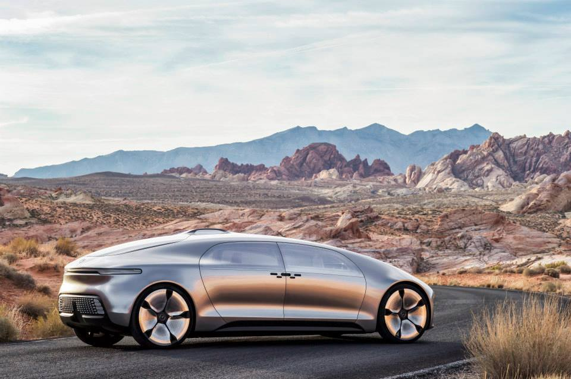
 

 
 

## Introduction

In this project, we implement a Deep Neural Network model to predict the steering angle of a car given images of the road. We use a [simulator](https://d17h27t6h515a5.cloudfront.net/topher/2017/January/587527cb_udacity-sdc-udacity-self-driving-car-simulator-dominique-development-linux-desktop-64-bit-5/udacity-sdc-udacity-self-driving-car-simulator-dominique-development-linux-desktop-64-bit-5.zip) to generate the dataset and to train and to test the model. The model was tested on 2 different tracks with the car in semi-autonomous mode: the only hard-coded value is that of the throttle opening (0.8). The model was trained using images recorded on Track 1, whereas images from Track 2 were never shown to the model. 

I used the training dataset provided by Udacity ([here](https://d17h27t6h515a5.cloudfront.net/topher/2016/December/584f6edd_data/data.zip)). The dataset includes images of the road recorded by 3 cameras mounted on the front of the car, and a csv file with steering angle values for each frame/image. In fact, the speed, the throttle opening and the break status are also recorded, so one could implement a Neural Network that predicts both the steering angle and the throttle opening (see Conclusion). 

The following characteristics can affect the predictor performance: different texture of the road pavement, change in the landscapes (grass, lake), edges of the road with different line styles (yellow line versus white/red stripped lines), shades on the road, different turn directions, varying brightness.

## List of files:

1. **model.h5** (weights) and **model.json** (architecture) are compressed in a *zip* file.

2. **pre_processing.py**: contains the functions needed to prepare the images and perform data augmentation.

3. **model.py** : the Neural Net steering angle predictor.

4. **drive.py**: enables to run the car in autonomous mode. The images from the simulator are pre-processed in real-time as to match the shape of the input images used during training. I added a few lines of codes to be able to save locally the images generated by the simulator.

5. **behavioral_cloning.ipynb**: a walk-thru the data exploration and visualization, the data pre-processing and the training of the model. The visualization of the weights and of the activations at different convolutional layers are provided.

To run the car in autonomous mode, open the simulator --> Click on *Autonomous*, and in a Terminal, run:

`python drive.py model.json'

## Data Exploration
The dataset is made of a total of 24108 images (for left/center/right camera). Below are a few examples of the training set images and the corresponding steering angles *s* (in radians).

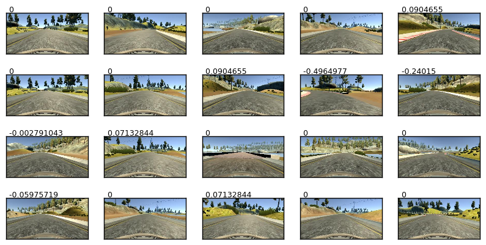

Below is a typical profile of the steering angles for successive frames. Clearly, the steering angle = 0rad is more frequent.

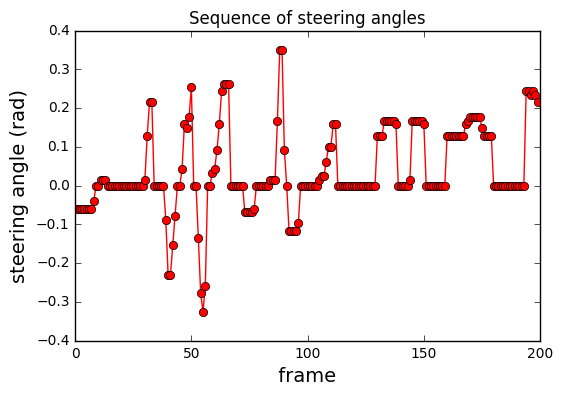

We look at the histogram of the steering angle in the entire dataset. *s=0* have the highest occurence: more than 20 times the frequency of other angle values. Furthermore, there are more positive (1900 counts) than negative angle values (1775 counts). The frequency decreases with increasing steering angle value. For |*s*| > 0.5rad, the counts are negligible.

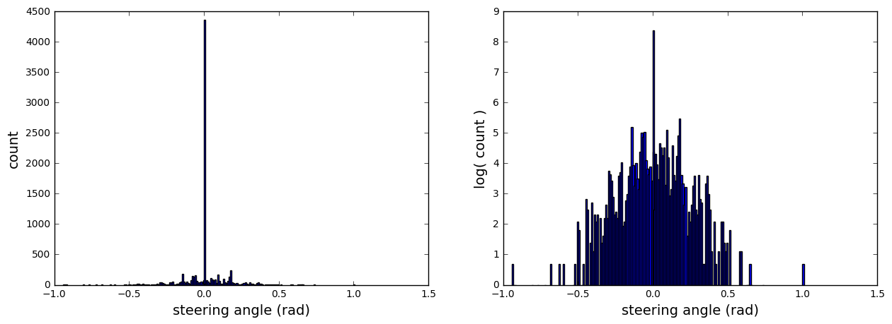

## Data preparation

Similarly to a classification problem, we need to make sure that our dataset is balanced, *i.e* the frequency of negative angle is about the same as that of the positive angle for example, and that a steering angle value is not over-represented in the dataset. I use several data augmentation schemes to balance the dataset.

### Data split
Before any pre-processing, the dataset is split into a training set and a validation set with a size ratio 5:1.

### Region of Interest
We want the model to focus on pixels/features that are relevant for predicting the steering angle: the lines on the edge of the road. The images are cropped along the vertical axis and keep the image width unchanged. We take out 20px from the bottom of the image that excludes the front end of the car, and 80px from the top that removes pixels above the horizon. After cropping, the image size is (80, 260, 3). We finally scale the image to (128, 128, 3).

### Data augmentation

#### **Image brightness**: 
The images brightness is varied to account for different lighting conditions. The images are first converted from RGB to HSV and the *Value* component is scaled by a factor *alpha* in the range [0.1, 1]. A small value of *alpha* makes the image darker. *alpha* value is drawn from a uniform distribution. 
The images are then converted back to RGB format. 

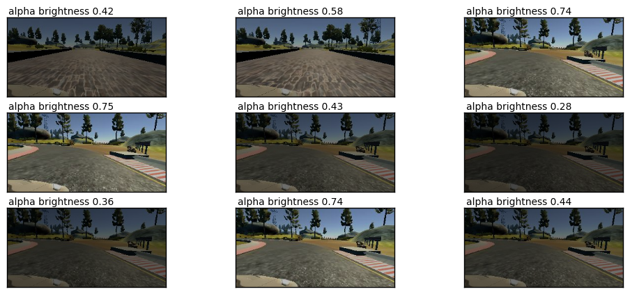

#### **Horizontal flip**: 

The images are flipped horizontally and the steering angle *s* is adjusted accordingly: *s*_flip = -*s*

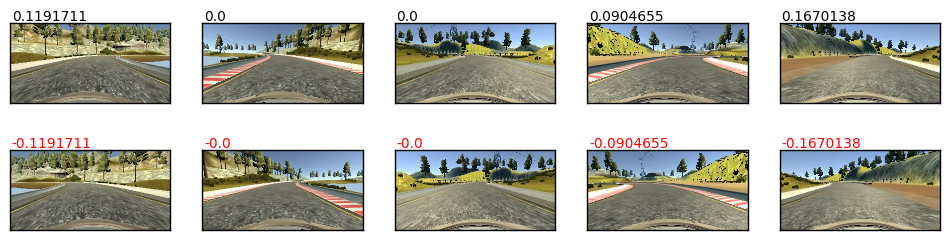

In the data augmentation algorithm, each image has 50% chance to be flipped. 

#### Generate a synthetic **cross-track error** by using the images from the left and the right camera:

In the sketch below, the steering angle is *s*, and the position of the center and the left camera is *C* and *L* respectively. The view from the left camera implies that the center of the car is at the position: *L*. In order to recover its position, the car would need to have a larger steering angle *s'*.

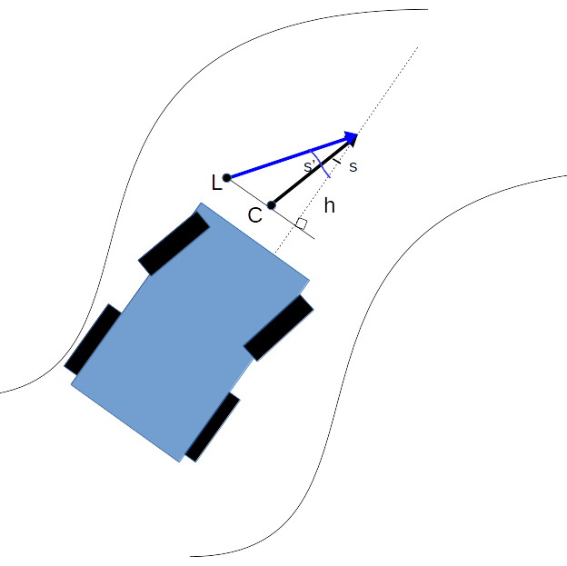

We can show that:

tan(*s'*) = tan(*s*) + *LC*/h

The distance between the center camera and the left or right camera is taken as: *LC*=1m (an average car has a width between 1.8-2m). I assume a constant recovery distance h=4m. Because most angles are small (see histogram above), to a first order approximation: tan(*s*)~*s*. Hence, for the **left camera**:

*s'* = *s* + 1/4

and for the **right camera**:

*s'* = *s* - 1/4

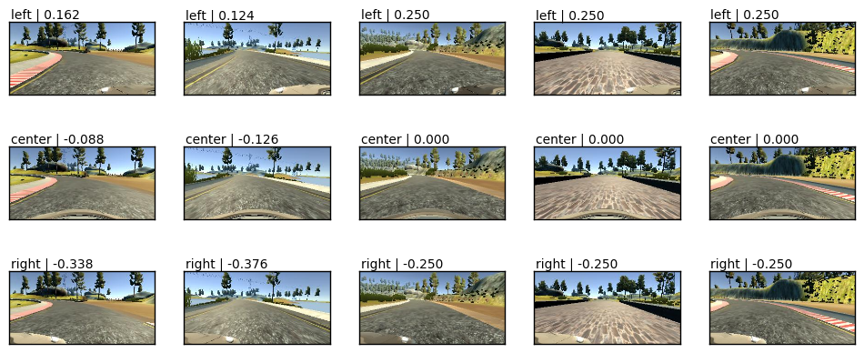

#### Scale pixel intensity

The pixel intensity space of the images is reduced from [0, 255] down to [-0.5, 0.5]:

*X* = (*X*/255) - 0.5,

where *X* is the image in matrix form.

#### Filter out examples with steering angle *s*= 0

At each EPOCH, 95% of the examples with steering angle *s=0* are deleted from the dataset. At the start of each EPOCH, the training dataset is shuffled and we randomly filter out a new set of examples with *s*= 0. With this approach, the same images are not disregarded for the entire training process.

### Data generator

Instead of loading the entire dataset into memory during training and during validation, I use the `fit_generator()` method of Keras. The model is trained by producing in real time batches and data augmentation.

The model uses 40,000 images per EPOCH during training with a batch size of 200 images (below is a selection of images after they have been pre-processed)

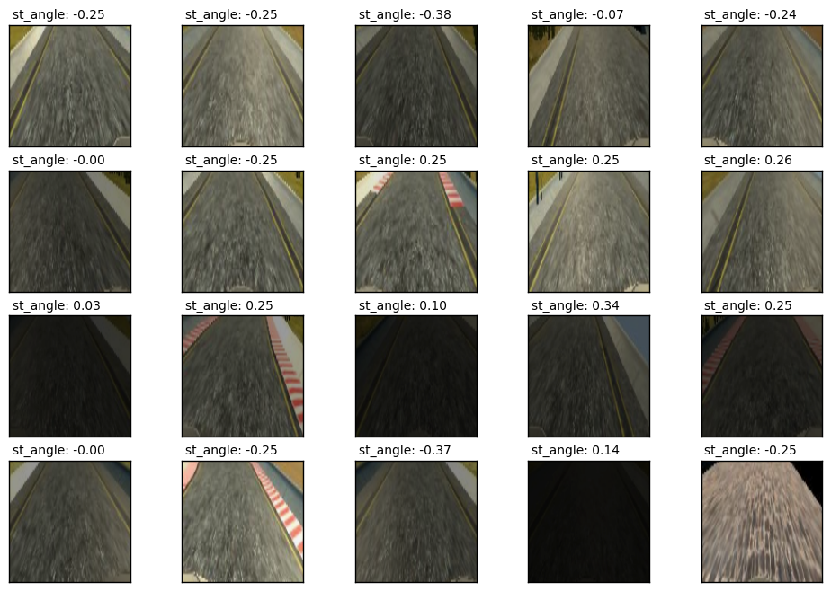

## Model architecture

For this project, I decided to implement a Neural Network from scratch, that uses a limited number of parameters.

With an input image (128 x 128 x3), the number of parameters in this *light-weight* model is 183,683. As a comparison, the NVidia model would have about 6 Millions parameters for the same image size.

The feature extractor is made of 4 convolutional layers:

* convolutional layer 1: (5 x 5 ) x8

* convolutional layer 2: (5 x 5 ) x8

* convolutional layer 3: (4 x 4 ) x 16

* convolutional layer 4: (5 x 5 ) x 16

They are followed by 3 dense layers with 128 nodes, 50 nodes, 10 nodes and finally the output layer with a single node. 

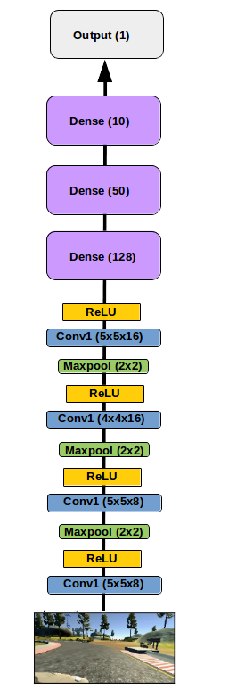

____________________________________________________________________________________________________
Layer (type)                     Output Shape          Param #     Connected to                     

====================================================================================================

conv1 (Convolution2D)            (None, 124, 124, 8)   608         convolution2d_input_1[0][0]      
____________________________________________________________________________________________________
activation_1 (Activation)        (None, 124, 124, 8)   0           conv1[0][0]                      
____________________________________________________________________________________________________
maxpooling2d_1 (MaxPooling2D)    (None, 62, 62, 8)     0           activation_1[0][0]               
____________________________________________________________________________________________________
convolution2d_1 (Convolution2D)  (None, 58, 58, 8)     1608        maxpooling2d_1[0][0]             
____________________________________________________________________________________________________
activation_2 (Activation)        (None, 58, 58, 8)     0           convolution2d_1[0][0]            
____________________________________________________________________________________________________
maxpooling2d_2 (MaxPooling2D)    (None, 29, 29, 8)     0           activation_2[0][0]               
____________________________________________________________________________________________________
convolution2d_2 (Convolution2D)  (None, 26, 26, 16)    2064        maxpooling2d_2[0][0]             
____________________________________________________________________________________________________
activation_3 (Activation)        (None, 26, 26, 16)    0           convolution2d_2[0][0]            
____________________________________________________________________________________________________
maxpooling2d_3 (MaxPooling2D)    (None, 13, 13, 16)    0           activation_3[0][0]               
____________________________________________________________________________________________________
convolution2d_3 (Convolution2D)  (None, 9, 9, 16)      6416        maxpooling2d_3[0][0]             
____________________________________________________________________________________________________
activation_4 (Activation)        (None, 9, 9, 16)      0           convolution2d_3[0][0]            
____________________________________________________________________________________________________
flatten_1 (Flatten)              (None, 1296)          0           activation_4[0][0]               
____________________________________________________________________________________________________
dense_1 (Dense)                  (None, 128)           166016      flatten_1[0][0]                  
____________________________________________________________________________________________________
activation_5 (Activation)        (None, 128)           0           dense_1[0][0]                    
____________________________________________________________________________________________________
dense_2 (Dense)                  (None, 50)            6450        activation_5[0][0]               
____________________________________________________________________________________________________
activation_6 (Activation)        (None, 50)            0           dense_2[0][0]                    
____________________________________________________________________________________________________
dense_3 (Dense)                  (None, 10)            510         activation_6[0][0]               
____________________________________________________________________________________________________
activation_7 (Activation)        (None, 10)            0           dense_3[0][0]                    
____________________________________________________________________________________________________
dense_4 (Dense)                  (None, 1)             11          activation_7[0][0]               

====================================================================================================

The figures below show a selection of filters of the convolutional layers, and the activation when using the 'relu()' function, for a given input image.

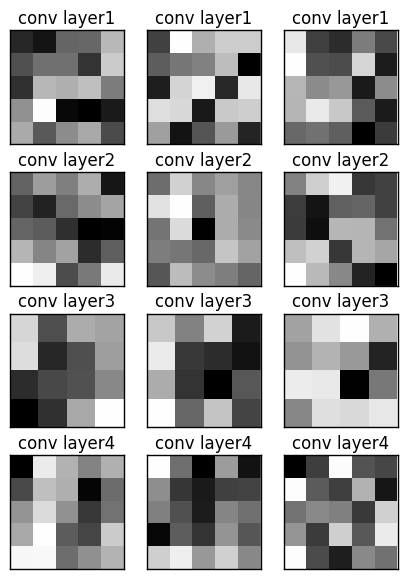

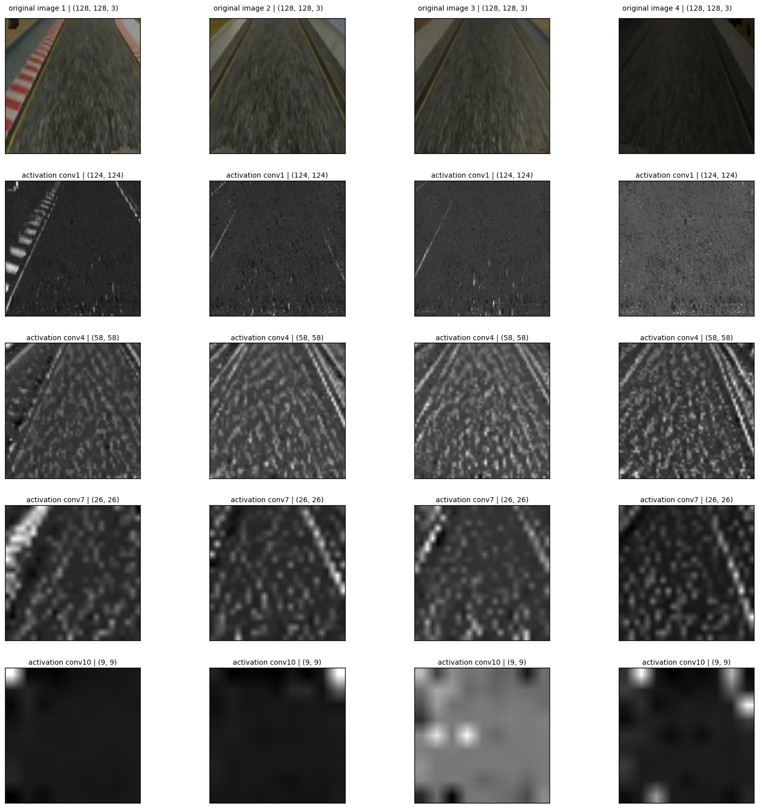

Most of the nodes related to the road lines are ON, appears as light gray.

* **optimizer:** *Adam* optimizer with the default learning rate (lr=0.001)

* **Maximum EPOCH**: 15 

After 15 EPOCHS, the training loss is 0.0085, and the validation loss is 0.0204.

## Optimization
My goal was to be able to have the car driving a full lap of Track1 and most of Track2 distance.

### overfitting
The large difference between the training loss and the validation loss indicates that the model is overfitting the training set.
*L2* regularization was efficient at controlling overfitting. We apply regularization only on the dense layers. 
With *L2* regularization, after 15 EPOCHS, validation loss is 0.0151 and the training loss is 0.0131.
Any attempt to control further the overfitting, using larger coefficient for the L2 regularizer, and/or Dropout resulted in a worst performance: for example, in Track 1 the car would miss the left turn afer the bridge.

### The correction for cross-track error

In the model, the correction (*LC*/h) is an hyper-parameter. The distance *LC*=1m is considered fix, and only the recovery distance h is adjusted.
Increasing the recovery distance to h=10-20 gives better performance on Track1: the car keeps a staighter direction, and does not wave from left to right. If the recovery is too fast/agressive, the car oscillates and can gets out of the road very quickly.
I chose h=4, so that the car performs relatively well on Track1 despite some waviness, and it also performs well on Track2.

### Test track
The car is able to complete several laps on the Track 1. The model also generalises relatively well to new data: the car can successfully complete 2/3rd of Track2 ([Autonomous mode on track 2](https://www.youtube.com/watch?v=esVH7HmJVcg&t=6s). On Track1, it is evident that the shadows on the road are interpreted by the model as road lines: the car would change path in order to avoid the shadow. One coudl potentially add "patches" of dark region on the road to emulate the shadow so that the mode llearns that those features are not relevant for predicting the steering angle.

## Conclusion
This was a fun project! There is much more that can be done with the data provided by the simulator. Indeed, as I mentioned in the Introduction, the simulator poutputs the speed and the throttle opening for each frame. My goal is to tweak the Neural Net so that it is able to predict both the steering angle and the throttle opening.