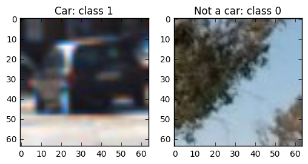
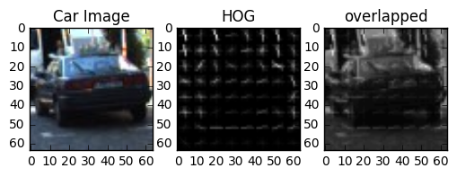
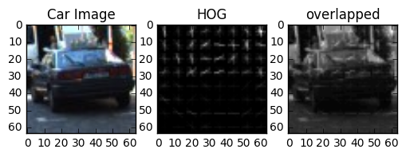
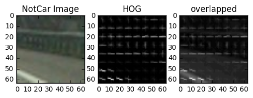
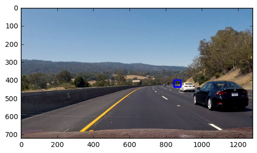
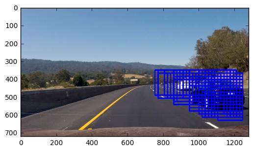
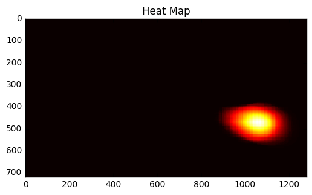
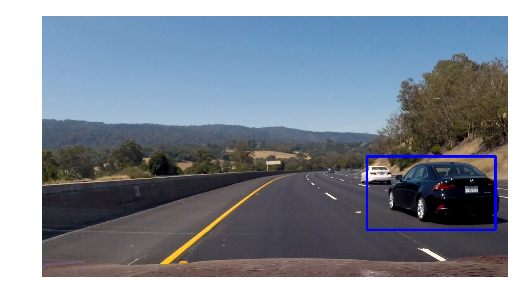
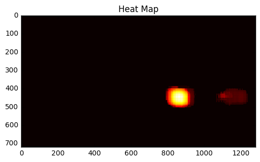
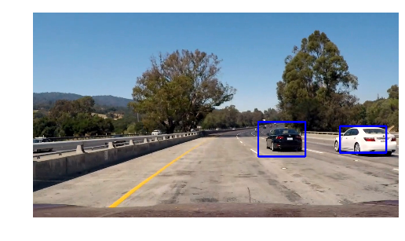

# Vehicle Detection


In this project, we use computer vision techniques to detect and track vehicles on the road.


## Summary
The steps of the Vehicle Detection pipeline are:

* Perform a Histogram of Oriented Gradients (HOG) feature extraction on a labeled training set of images
* Normalize the features and randomize the dataset
* Train a Linear SVM classifier 
* Implement a sliding-window technique and use the trained classifier to search for vehicles in images.
* Run the pipeline on a video stream and create a heat map of recurring detections frame by frame to reject outliers and follow detected vehicles.
* Estimate a bounding box for vehicles detected.

## How to run?

There are 2 IPython Notebooks:

* `classifier_svc.ipynb` to extract features from the dataset and train the Support Vctor machine Classifier
* `vehicleDetection_P5.ipynb` enables to run the vehicle detection on a video

To run the code on an arbitrary video file, update the 6th code cell with the name of the input video file:

```python
video_output = 'project_solution.mp4' # name of the video file generated by the vehicle detector
clip1 = VideoFileClip("project_video.mp4") #original video file
white_clip = clip1.fl_image(pipeline)
%time white_clip.write_videofile(video_output, audio=False)
```


## Features

For this project, I used the labeled dataset available [here](https://s3.amazonaws.com/udacity-sdc/Vehicle_Tracking/vehicles.zip) for vehicle images and [here](https://s3.amazonaws.com/udacity-sdc/Vehicle_Tracking/non-vehicles.zip) for non-vehicle images. Below are 2 random images of each class:



### 1. HOG feature extraction

The code to extract the HOG features from the training images is contained in the IPython Notebook `classifier_svc.ipynb` in the 4th code cell. 


```python
def get_hog_features(img, orient, pix_per_cell, cell_per_block, vis=False, feature_vec=True):
    '''
    Extract HOG image and HOG features of a given image
    orient: number of bins for the orientation
    pix_per_cell: size of a cell
    cell_per_block: nber of cells per block
    vis (Boolean) visualize the HOG image
    feature_vec (Boolean): return the features as a feature vector
    By default, the function uses transform_sqrt (apply power law compression to normalize the image before processing)
    '''

```

Below is the HOG images for the 3 color channels (Y, Cr, Cb) of a car image. For each channel, the original image, the HOG image and the combined image (original + HOG) are shown in column 1, 2, 3 respectively.

** Channel Y**


** Channel Cr**


** Channel Cb**


For comparison, the HOG of an image of the road is shown below:

** Channel Y**



The HOG features of a car and an image of the road shows clear differences that can be used for the classification task.   

### 2. HOG Parameters

I tried different color spaces and different parameters for `get_hog_features()` such as different orientation bins size, cell size, number of cells per block and color channel of the input image. 

The best performance of the classifier was achieved using YCrCb color space and HOG parameters of `orientations=9`, `pixels_per_cells=(8,8)`, and `cells_per_block=(2,2)`.


### 3. Binned Color features

In the 4th code cell of the IPython Notebook `classifier_svc.ipynb`, I define a function to compute binned color features:

```python
def bin_spatial(img, size=(32, 32)):
    '''
    Binned Color Feature
    img: original image
    size: target size of the image
    output: feature vector
    '''
```

### 4. Histogram features

The histogram feature `color_hist()` is not used in my implementation.

```python
def color_hist(img, nbins=32, bins_range=(0, 256)):
    '''
    Color histogram features for each channel of the original image
    img: original image
    nbins: number of bins of the histogram
    output: concatenate feature vector
    '''  
```

### 5. Feature extractor

The functions to extract the features for the dataset are combined into `extract_features()` (4th code cell of `classifier_svc.ipynb`):

```python
def extract_features(imgs, color_space='RGB', spatial_size=(32, 32),
                        hist_bins=32, orient=9, 
                        pix_per_cell=8, cell_per_block=2, hog_channel=0,
                        spatial_feat=True, hist_feat=True, hog_feat=True, hog_vis=False):
    '''
    Feature extractor: extract features from a list of images
    The function calls bin_spatial(), color_hist() and get_hog_features
    ''' 
```

From each image, 7248 features are extracted and are used to train the classifier.


### 6. Best settings

I found the best results when using the set of parameters below (in the 5th code cell of `classifier_svc.ipynb`):

```python
color_space = 'YCrCb'  # Can be RGB, HSV, LUV, HLS, YUV, YCrCb
orient = 12  # HOG orientations
pix_per_cell = 8  # HOG pixels per cell
cell_per_block = 2  # HOG cells per block
hog_channel = "ALL"  # Can be 0, 1, 2, or "ALL"
spatial_size = (8, 8)  # Spatial binning dimensions
hist_bins = 16  # Number of histogram bins
hist_range = bins_range = (0,256)
spatial_feat = True  # Spatial features on or off
hist_feat = False  # Histogram features on or off
hog_feat = True  # HOG features on or off
```

### 7. Classifier Model

The features extracted from all the images of the dataset are stacked into an input  array `X`. The input data is first normalized using `StandardScaler()` from `sklearn.preprocessing`. The data is shuffled and then split into a training set and a test set with the ratio 5 to 1. The data preparation and splitting is done in the 7th code cell of IPython Notebook `classifier_svc.ipynb`.

The dataset is trained using a **Linear Support Vector Machine Classifier** (8th code cell of IPython Notebook `classifier_svc.ipynb`). The model achieves an accuracy of 1 on the training set and 0.9892 on the test set. The model generalizes well to new data.
The model and the parameters of the features extractor are saved in a pickle file (`model_svc.p`) in the 9th code cell of `classifier_svc.ipynb`.


## Sliding window Search

### 1. Sliding window settings

The sliding window is performed by the function `find_cars()` in the 5th code cell of the Ipython Notebook `vehicleDetection_P5.ipynb`:


def find_cars(img, ystart, ystop, cells_per_step, scale, svc, X_scaler, cspace, orient, pix_per_cell, 
              cell_per_block, spatial_feat, spatial_size, hist_feat,  hist_bins):
    '''
    uses a single HOG feature extraction on the entire image
    '''


A window of size (64x64)px is slided on an image scaled by a factor `scale`. This is equivalent of sliding a window of size (64x64)*`scale` on a image of fixed size.
I used the following scales and sliding window specifications:


```python
sliding_window = {'scale':[0.6, 0.8, 1.2, 1.6, 2, 2.2], 
          'ystart':[400, 400, 400, 350, 350, 350], 
          'ystop': [520, 520, 620, 620, 656, 656], 
          'cells_per_step': [3, 3, 1, 1, 1, 1]}
```

For the different scale, the sliding window scans across the horizontal and the vertical direction, with the vertical scanning area limited to the area between: `ystart` and `ystop`. The parameter `cells_per_step` is equivalent to the stride in px.

For each box, the *SVC* model predict the class of the image (car or notcar). If the model predictes a car for the pixel in the window, then the coordinates of the window frame are saved in a variable: `hot_windows`. 

### 2. Some examples

Below are a few examples of *positive* sliding windows (blue boxes) in an image:

** scale = 0.6**



** scale = 2**




## Video Implementation

### 1. Link to final Video output

Here is the link to the video:
https://youtu.be/cqI19e6YJls

The pipleine performs reasonably well on the entire project video. The bounding boxes are relatively stable in size and position. The vehicles are identified most of the time. The model is very good at tracking and detecting the black car but it shows poorer performance in tracking the white car. This could be improved by using additional data with white cars in the training dataset. In order to compensate for that, I used more sliding window sizes and small `cells_per_step`.
There are minimal false positive.


### 2. False Positives filters and combined bounding boxes.

The positions of all the positive detections in each frame of the video are stored in `hot_windows`. From the positive detections, a heatmap is created (see 6th code cell in `vehicleDetection_P5.ipynb`).


```
def add_heat(heatmap, bbox_list):
    '''
    iterate through list of positive sliding windows (bbox_list) and add heat 
    '''
```

A threshold is then applied on the heatmap to clear the map of false positives. With `scipy.ndimage.measurements.label()`, individual blobs (assumed to be cars) in the heatmap are identified. A bounding box that covers the area of each blob is generated, and provides the identification box of the vehicle (6th code cell).

```python
def apply_threshold(heatmap, threshold):
    '''
    Apply threshold on heatmap
    return thresholded heatmap where all values below threshold are set to 0
    '''
```

Below are a few examples of heat map and the corresponding identification box.

Example 1:

<table><tr><td>Heat Map</td><td>Corresponding identification box</td></tr>
<tr><td>
</td>
<td>
</td>
</table>

Example 2:

<table><tr><td>Heat Map</td><td>Corresponding identification box</td></tr>
<tr><td>

</td>
<td>
</td>
</table>


## Discussion

The main problem that I faced was properly identifying the white car in the video. Also, if the frames shows several cars next to each another, the model identifies them as a single vehicle. The model is likely to fail if the frame has a lot of noise and if the scenery includes shadows. In fact, in some portions of the video, where there are more shadows, there are also more false positive boxes. 

The model could be made more robust by:

* using a larger dataset: I used the small dataset with about 2000 images. A bigger dataset with larger variance in the cars color would help improve the detection of the white car for example. 

* using Neural Net classifier: the Neural Net is likely to select the optimum features taht would enable a better classification of the objects (car / not car).

